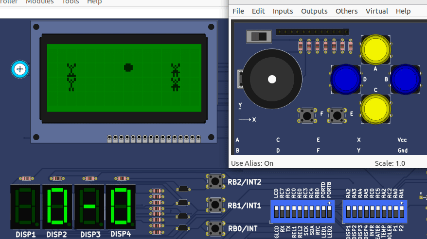

# Ultimate Frisbee - PIC18F4620
This project is a simulation of an Ultimate Frisbee game working on PIC18F4620 microcontroller.
It is implemented in C for the microcontroller and uses an LCD display to visualize the game.

## Features
* The game includes four players, two for each team. The players' positions are displayed on the LCD.
* The game uses a gamepad for user input. The gamepad has four directional buttons for moving the selected player and two additional buttons for throwing the frisbee and switching the selected player.
* The game includes a frisbee that can be held and thrown by the players. The frisbee's position is also displayed on the LCD.
* The game uses a pseudo-random number generator for the movements of the non-selected players and the frisbee.
* The game includes a 7-segment display that shows the score of each team.
* The game uses timers and interrupts for various tasks, such as moving the frisbee, blinking the target, and generating random numbers.
## Code Structure
* The code includes several functions for handling the game logic, such as moving the players, throwing the frisbee, and updating the display.
* The code uses a struct to store the game state, including the positions of the players and the frisbee, the score of each team, and the selected player.
* The code uses interrupts to handle the gamepad input and the timers.
* The code uses the ADC to read the value of a dial, which is used to set the period of the random movements.
Usage
To run the game, load the code onto a PIC microcontroller connected to an LCD display and a gamepad. The game starts immediately when the microcontroller is powered on.

Use the gamepad to move the selected player and throw the frisbee. The goal is to get the frisbee to the target position on the opponent's side.
